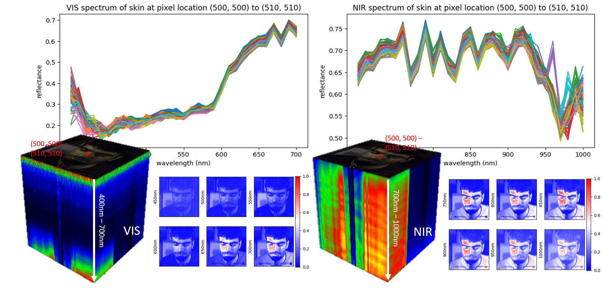
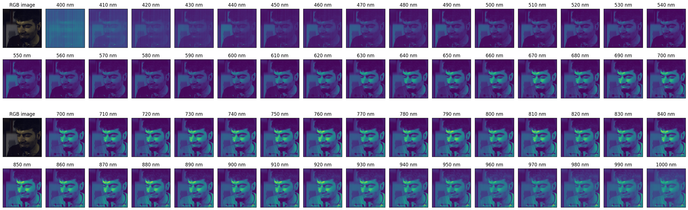

## Hyper-Skin 2023 Data
----
[Project Page](https://hyper-skin-2023.github.io/) |[Dataset Access Request](https://hyper-skin-2023.github.io/dataset/)


> 🚩 **Note** 
> 
> A subset of data (with consent from the participants) are available for exploration. Check [here](https://hyperspectral-skin-2023-hyperskin-app-main-uvtyau.streamlit.app/Hyper-Skin(RGB,_VIS)?utm_medium=oembed) for the VIS data, and [here](https://hyperspectral-skin-2023-hyperskin-app-main-uvtyau.streamlit.app/Hyper-Skin(MSI,_NIR)?utm_medium=oembed) for the NIR data.


## Introduction


This repository contains the codes for the benchmark evaluation design for **Hyper-Skin 2023 dataset**. The instruction to request the access to the data can be found [here](https://hyper-skin-2023.github.io/dataset/). 
Hyper-Skin is a comprehensive hyperspectral dataset designed specifically for facial skin analysis. It covers a wide spectral range from visible (VIS) to near-infrared (NIR) spectra, allowing for a holistic understanding of various aspects of human facial skin. The dataset includes 330 hyperspectral cubes captured from 51 subjects, featuring diverse facial poses and angles. Each hyperspectral cube with spatial resolution of 1024 x 1024 contains 1,048,576 spectra of length 448, providing a rich and detailed representation of skin properties.  The 448-bands data is resampled into two 31-band datasets: one covering the visible spectrum from 400nm to 700nm, and the other covering the near-infrared spectrum from 700nm to 1000nm. Additionally, synthetic RGB and Multispectral (MSI) data are generated, comprising RGB images and an infrared image at 960nm. These steps result in the creation of our Hyper-Skin dataset, encompassing two types of data: (RGB, VIS) and (MSI, NIR). 

To ensure an unbiased evaluation of our data, we employed a participant-based data splitting approach. Specifically, we randomly selected 10% of the participants from our participant pool and allocated their data exclusively to the testing set. This method ensures that the testing set contains facial skin data from unseen subjects, who were not represented in the training set. By using participant-based data splitting, we mitigate the risk of potential bias and ensure a more robust assessment of the generalization capabilities of our models. 




### Data Download Instructions
----
To request access to the dataset, interested researchers must follow the credentialization procedures. This includes digitally signing the End User License Agreement (EULA) with their official affiliation, acknowledging and agreeing to the terms and conditions stated in the agreement. Please read and sign the EULA [here](https://hyper-skin-2023.github.io/dataset/). The pdf version of the EULA is available [here](documents/EULA-2023.pdf) for your record.

In each dataset, you can find the (input, output) pair folders. For (RGB, VIS), the input folder is named as RGB_{camera type} and the output folder is named HSI_VIS; whereas for (MSI, NIR), the input folder is named as MSI (which refer to the stack of RGB_CIE and infrared image at 960nm) and the output folder HSI_NIR. Note that we also provide the infrared image at 960nm in a single folder named IMG_960. This allow the interested user to stack the infrared image with other RGB data generated from other camera response function for futher experiment. 
In each folder, there are train and test subfolder containing the training set data and testing set data. The organization of the data is as follows:


```shell
 |-- Hyper-Skin(RGB, VIS) 
     |-- HSI_VIS
         |-- train
             |-- p{xxx}_{facial_pose}_{direction}.mat
             |-- ...
             |-- ...
         |-- test
             |-- p{xxx}_{facial_pose}_{direction}.mat
             |-- ...
             |-- ...
     |-- RGB_{camera_type}
         |-- train
             |-- p{xxx}_{facial_pose}_{direction}.mat
             |-- ...
             |-- ...
         |-- test
             |-- p{xxx}_{facial_pose}_{direction}.mat
             |-- ...
             |-- ...
```
Note that for '{xxx}' refer to the subject id, '{facial_pose}' refers to two types of facial pose, either neutral or smile, and '{direction}' indicating the direction of the face been taken.

### Baseline Models
----
We used three spectral reconstruction algorithms as the baseline models for our experiments. These three models HSCNN, HRNet and MST++ were the winning models for the NTIRE spectral reconstruction challenge in 2018, 2020, and 2022, respectively. 

The pretrained models on NTIRE2022 dataset are provided by [caiyuanhao1998](https://github.com/caiyuanhao1998) and can be downloaded from [here](https://github.com/caiyuanhao1998/MST-plus-plus).


### Benchmarking and Evaluation Scripts
----
We provided the two metrics, i.e., SSIM and SAM, we used to evaluate our experiments in the utils script, availabe [here](utils/metrics.py)
The data loader script is provided [here](hsiData). 
We also provided experimental notebooks that user can follow to repeat the experiment either on the (RGB, VIS) or (MSI, NIR) data pairs. 
These experimental notebooks are provided in the jupyter notebook format and can be found [here](experiments).


### Citation
----
If you use this package or the associated dataset, please kindly cite these following BibTeX entries:

```
@misc{hs2013,
title={Hyper-Skin: A Hyperspectral Dataset for Reconstructing Facial Skin-Spectra from RGB Images},
author={Pai Chet Ng, Zhixiang Chi, Yannick Verdie, Juwei Lu, Konstantinos N. Plataniotis},
year={2023}
}
```

### MIT License
----
Copyright (c) 2023 Hyper-Skin

Permission is hereby granted, free of charge, to any person obtaining a copy
of this software and associated documentation files (the "Software"), to deal
in the Software without restriction, including without limitation the rights
to use, copy, modify, merge, publish, distribute, sublicense, and/or sell
copies of the Software, and to permit persons to whom the Software is
furnished to do so, subject to the following conditions:

The above copyright notice and this permission notice shall be included in all
copies or substantial portions of the Software.

THE SOFTWARE IS PROVIDED "AS IS", WITHOUT WARRANTY OF ANY KIND, EXPRESS OR
IMPLIED, INCLUDING BUT NOT LIMITED TO THE WARRANTIES OF MERCHANTABILITY,
FITNESS FOR A PARTICULAR PURPOSE AND NONINFRINGEMENT. IN NO EVENT SHALL THE
AUTHORS OR COPYRIGHT HOLDERS BE LIABLE FOR ANY CLAIM, DAMAGES OR OTHER
LIABILITY, WHETHER IN AN ACTION OF CONTRACT, TORT OR OTHERWISE, ARISING FROM,
OUT OF OR IN CONNECTION WITH THE SOFTWARE OR THE USE OR OTHER DEALINGS IN THE
SOFTWARE.


